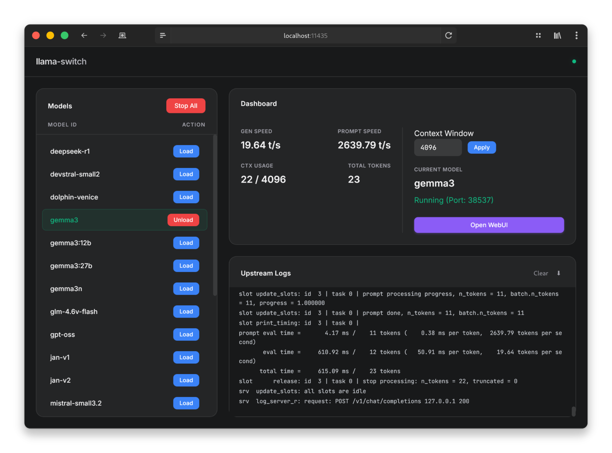

# Llama Switch



A lightweight, modern WebUI manager for switching between local inference servers seamlessly.

Llama Switch puts one dashboard and one OpenAI-compatible endpoint in front of several engines: [llama.cpp](https://github.com/ggerganov/llama.cpp) for text, speech recognition and audio/vision input, [stable-diffusion.cpp](https://github.com/leejet/stable-diffusion.cpp) for images, [qwentts.cpp](https://github.com/ServeurpersoCom/qwentts.cpp) for speech synthesis, [audio.cpp](https://github.com/0xShug0/audio.cpp) for music generation. One model runs at a time; loading another stops the current one automatically.

## Features

- **Four kinds of model in one config**: `llm`, `sd`, `tts` and `music` sections, shown in the UI as **Language**, **Image**, **Speech** and **Music**.
- **One-click switching**: automatically stops the current model and starts the new one.
- **Auto-switching from the API**: a request that names a `model` loads it first, whether the name arrives in a JSON body (chat, images, speech) or in a multipart upload (transcriptions, image edits).
- **Real-time dashboard**, per kind:
  - **Language:** generation speed (t/s), prompt speed (t/s), context usage, total tokens.
  - **Image:** step time, last image time, step progress, images generated.
  - **Speech:** speed as a multiple of realtime, last clip's length against the time it took, frames generated, clips.
- **Configurable limits**: context window for `llm`, max frames for `tts`, set before loading a model, remembered per kind.
- **Upstream Logs**: view raw engine logs directly in the UI.
- **Theme Support**: built-in Dark and Light modes.
- **WebUI Link**: opens the running engine's own interface on the engine's own address. Engine pages request their paths absolutely, so none of them survive being served under a prefix here.
- **HTTPS**: serve the whole thing over TLS, which is what makes the microphone reachable from another device.
- **Config hot-reload**: with `--watch`, edits to the config are picked up without a restart.

## Prerequisites

- **Python 3.8+** with `fastapi`, `uvicorn`, `pyyaml` and `httpx`.
- **llama-server**: the binary from `llama.cpp`, in `PATH` or given by absolute path in the config.
- Optional, only for the sections you use: `sd-server` from `stable-diffusion.cpp`, `tts-server` from `qwentts.cpp`, `audiocpp-server` from `audio.cpp` (upstream builds it as `audiocpp_server`).

## Installation

1. **Clone the repository:**
   ```bash
   git clone https://github.com/your-username/llama-switch.git
   cd llama-switch
   ```

2. **Install Python dependencies:**
   ```bash
   pip install fastapi uvicorn pyyaml httpx
   ```

## Configuration

Create a `config.yaml` file in the root directory. Models are grouped into up to four sections; you can define as many models as you like in each, and leave out any section you do not use.

Use `${HOST}`, `${PORT}`, `${CTX}` and `${FRAMES}` placeholders in your command string; the server injects the values automatically. `${CTX}` is the context window and only means anything for `llm`; `${FRAMES}` is the audio frame cap and only means anything for `tts`. The bare forms `$HOST`, `$PORT`, `$CTX` and `$FRAMES` work too.

**Example `config.yaml`:**

```yaml
llm:
  # Model with multiple quantizations
  qwen-3:
    q4_k_m: llama-server --host ${HOST} --port ${PORT} --model /path/to/qwen3-instruct-q4_k_m.gguf -c ${CTX} -ngl 99
    q8_k_xl: llama-server --host ${HOST} --port ${PORT} --model /path/to/qwen3-instruct-UD-Q8_K_XL.gguf -c ${CTX} -ngl 99

  # Multimodal model, vision and/or audio input (with mmproj)
  gemma-3:
    q4_k_m: llama-server --host ${HOST} --port ${PORT} --model /path/to/gemma-3-it-q4_k_m.gguf --mmproj /path/to/gemma-3-it-mmproj.gguf -c ${CTX} -ngl 99

  # Speech recognition also runs on llama-server, so it belongs here
  qwen3-asr:
    q8: llama-server --host ${HOST} --port ${PORT} --model /path/to/Qwen3-ASR-1.7B-Q8_0.gguf --mmproj /path/to/mmproj-Qwen3-ASR-1.7B-Q8_0.gguf -c ${CTX} -ngl 99

sd:
  z-image:
    q8_0: sd-server -l ${HOST} --listen-port ${PORT} --diffusion-model /path/to/z_image_turbo-Q8_0.gguf --vae /path/to/ae.safetensors --steps 8 --cfg-scale 1.0 -v

tts:
  qwen3-tts:
    q8: tts-server --host ${HOST} --port ${PORT} --model /path/to/qwen-talker-1.7b-base-Q8_0.gguf --codec /path/to/qwen-tokenizer-12hz-Q8_0.gguf --max-new ${FRAMES}

music:
  minimax-music3:
    q4: audiocpp-server --config /path/to/music.json --host ${HOST} --port ${PORT} --busy-timeout-ms 0
```

- `-ngl 99`: offloads layers to GPU (adjust based on your hardware).
- `-c ${CTX}`: sets the context window (controllable via UI).
- `--max-new ${FRAMES}`: caps clip length (controllable via UI).

**Default quantization:** the **first** quant listed for a model is its default. Through the OpenAI-compatible API (`/v1/models`, `/v1/chat/completions`) that default is exposed under the bare model id (e.g. `qwen-3`), while the rest get a `-<quant>` suffix (e.g. `qwen-3-q8_k_xl`). Requesting the bare id loads the first-listed quant, so order each model's variants with the preferred one first.

**Model ids are global.** If the same key appears in two sections, the first one wins in `llm` → `sd` → `tts` → `music` order and the duplicate is logged and skipped.

**Older configs still work.** A pre-sections config that puts everything under a single `models:` key is read as the `llm` section; an explicit `llm:` section always wins over it.

## API

Every request is served by whichever model is currently loaded. Requests that name a `model` load it first, so a chat client, an image client and a speech client can each pull their own model in without touching the dashboard. A request aimed at a section other than the running one, and naming no model, gets a `409` telling you which kind is loaded.

| Endpoint | Section |
| --- | --- |
| `/v1/models` | `llm` (text models only, so chat clients are not offered image backends) |
| `/v1/chat/completions`, `/v1/completions`, `/v1/responses` | `llm` |
| `/v1/audio/transcriptions`, `/v1/audio/translations` | `llm`, these are `llama-server`'s own ASR endpoints |
| `/v1/images/*` (OpenAI), `/sdapi/v1/*` (AUTOMATIC1111), `/sdcpp/v1/*` (native) | `sd` |
| `/v1/audio/speech`, `/v1/audio/voices` | `tts` |
| `/v1/tasks/*` | `music`, `audio.cpp`'s own generation endpoint |
| `/api/config`, `/api/status`, `/api/logs`, `/api/start`, `/api/stop` | management |

## Usage

1. **Start the server:**
   ```bash
   python server.py --config config.yaml --watch
   ```

2. **Open the Dashboard:**
   Navigate to `http://localhost:11435` in your browser.

3. **Control Models:**
   - Select a model from the left sidebar and click **Load**.
   - Change the **Context Window** (language models) or **Max Frames** (speech models) in the dashboard if needed.
   - Click **Open WebUI** to access the running engine's native interface.
   - Click **Stop** or load another model to terminate the current session.

### Command line

| Flag | Default | Meaning |
| --- | --- | --- |
| `-H`, `--host` | `localhost` | interface for the UI **and** for the engines it launches |
| `-p`, `--port` | `11435` | UI port (engines get a free port each) |
| `-c`, `--ctx` | `4096` | default context window |
| `-f`, `--config` | `config.yaml` | config file path |
| `-w`, `--watch` | off | reload the config when it changes on disk |
| `--tls-cert`, `--tls-key` | off | PEM certificate and key; giving both switches the UI to `https` |

### HTTPS and the microphone

Browsers only hand over the microphone in a secure context. `localhost` counts as one over plain http, but any other address does not, including a phone or laptop reaching the machine by hostname or IP, and the recording controls simply disappear there. Pass `--tls-cert` and `--tls-key` to serve over `https`, and make sure the certificate is signed by a CA the other device trusts: a self-signed certificate is rejected outright, and a click-through warning is not enough to restore a secure context.

This covers the dashboard and the API. Engine pages opened through **Open WebUI** run on the engine's own port over plain `http`, so their recording controls are unavailable from another device.

> Note that `--watch` reloads the config by **stopping whatever is running**. Do not edit the config while a model is mid-generation.
