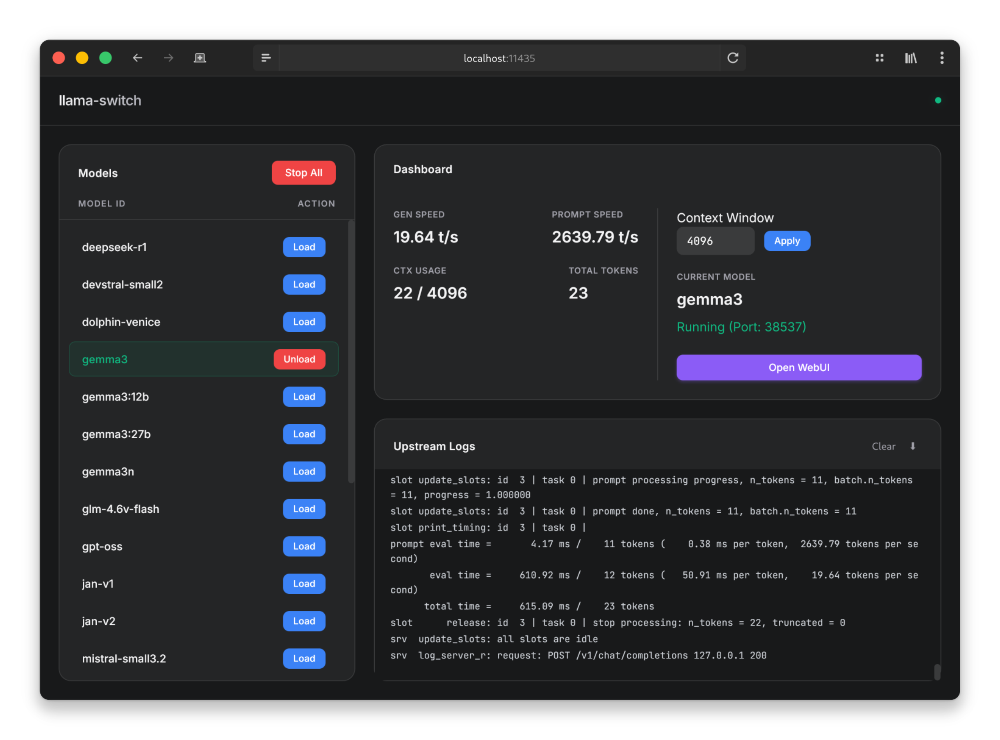

# Llama Switch



Легкий и современный Веб-интерфейс (WebUI) для удобного переключения между моделями [llama.cpp](https://github.com/ggerganov/llama.cpp).

Llama Switch предоставляет чистый дашборд для просмотра локальных LLM моделей, их запуска/остановки по требованию и мониторинга статистики генерации в реальном времени (токены/сек, скорость обработки промпта, использование контекста).

## Возможности

- **Управление моделями**: Определение множества моделей в простом YAML конфиге.
- **Переключение в один клик**: Автоматически останавливает текущую модель перед запуском новой.
- **Дашборд реального времени**:
  - **Скорость генерации (Gen Speed):** Токены в секунду (t/s).
  - **Скорость промпта (Prompt Speed):** Скорость обработки входящего запроса.
  - **Трекер контекста:** Визуальное отображение заполненности контекстного окна.
  - **Всего токенов:** Счетчик токенов текущей сессии.
- **Настраиваемый контекст**: Изменение размера контекстного окна (Context Window) прямо перед загрузкой модели.
- **Логи сервера**: Просмотр сырых логов `llama-server` прямо в интерфейсе.
- **Темы оформления**: Встроенная поддержка темной и светлой темы.
- **Прокси/Ссылка на WebUI**: Прямая ссылка на нативный интерфейс запущенного `llama-server`.

## Требования

- **Python 3.8+**
- **llama-server**: Бинарный файл из проекта `llama.cpp` должен быть установлен и доступен в системном `PATH`, либо указан полный путь к нему в конфиге.

## Установка

1. **Клонируйте репозиторий:**
   ```bash
   git clone https://github.com/your-username/llama-switch.git
   cd llama-switch
   ```

2. **Установите зависимости Python:**
   ```bash
   pip install fastapi uvicorn pyyaml httpx
   ```

## Настройка

Создайте файл `config.yaml` в корневой директории. Вы можете добавить любое количество моделей.

Используйте плейсхолдеры `${PORT}` и `${CTX}` в строке команды запуска; приложение автоматически подставит нужные значения (порт по умолчанию `11435`, или назначенный приложением).

**Пример `config.yaml`:**

```yaml
models:
  # Простая текстовая модель
  mistral-7b:
    cmd: llama-server --port ${PORT} --model /path/to/models/mistral-7b-v0.3.Q4_K_M.gguf -c ${CTX} -ngl 99

  # Мультимодальная модель (Vision/Image, с mmproj)
  llava-v1.6:
    cmd: llama-server --port ${PORT} --model /path/to/models/llava-v1.6-7b.Q4_K_M.gguf --mmproj /path/to/models/mmproj-model-f16.gguf -c ${CTX} -ngl 99
```

- `-ngl 99`: Выгрузка слоев на GPU (настройте в зависимости от вашего железа).
- `-c ${CTX}`: Устанавливает размер контекстного окна (меняется через UI).

## Использование

1. **Запустите сервер:**
   ```bash
   python server.py --config config.yaml
   ```

2. **Откройте Дашборд:**
   Перейдите по адресу `http://localhost:11435` в вашем браузере.

3. **Управление:**
   - Выберите модель в левом списке и нажмите **Load**.
   - При необходимости измените размер **Context Window** (по умолчанию 4096).
   - Нажмите **Open WebUI**, чтобы открыть нативный интерфейс `llama.cpp`.
   - Нажмите **Stop** или загрузите другую модель, чтобы завершить текущую сессию.
